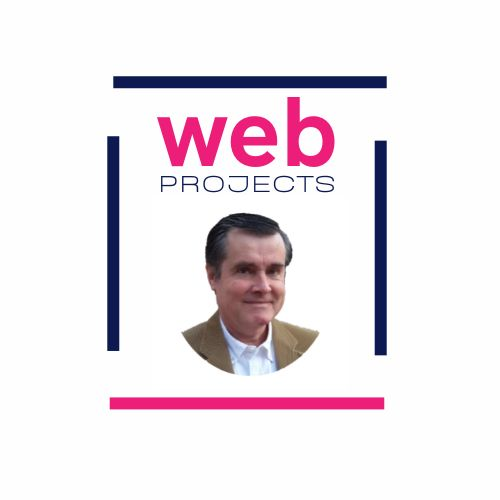

# Portfolio-Fuhr-Blog

Aplicación desarrollada con Gatsby.js para el front-end y Sanity.io (headless CMS) para almacenar el blog en el back-end. Esta aplicación la uso como un blog de los proyectos que he realizado y deployado.

This project is a fork from https://github.com/ShaifArfan/techHub-blog

